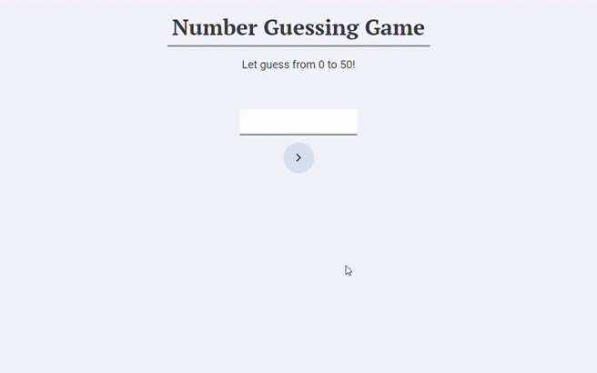

#Week 1 - Homework - Number Guessing Game in HTML

**Project Brief**

**Project Content**

The project will create a random number from 0 to 50. The player has to guess that number.
There are only 10 tries and if the player is out of tries, the game will reset after 5 seconds.